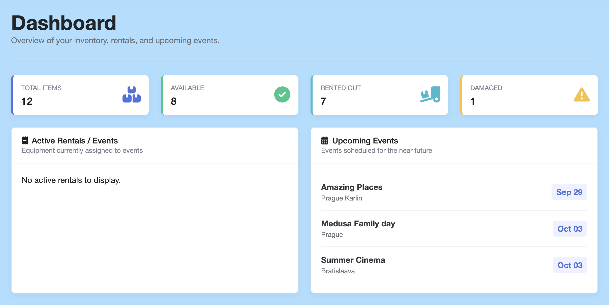
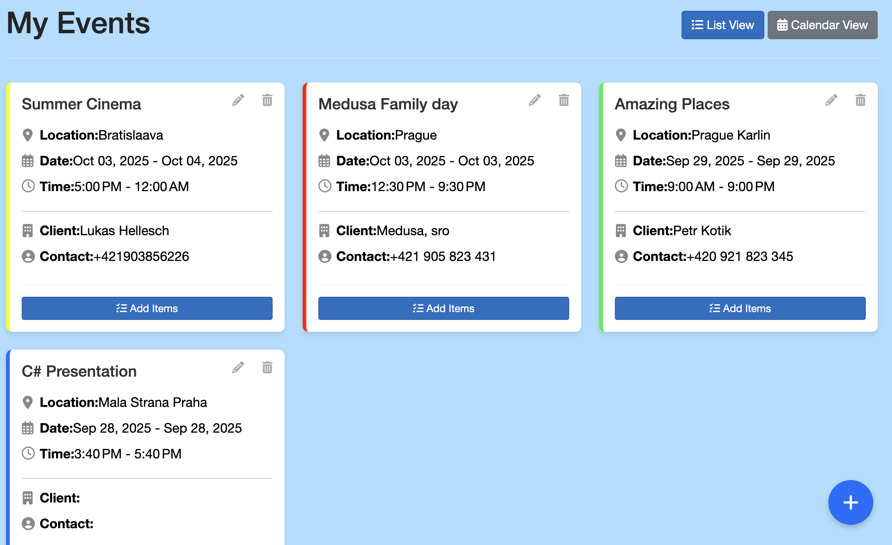
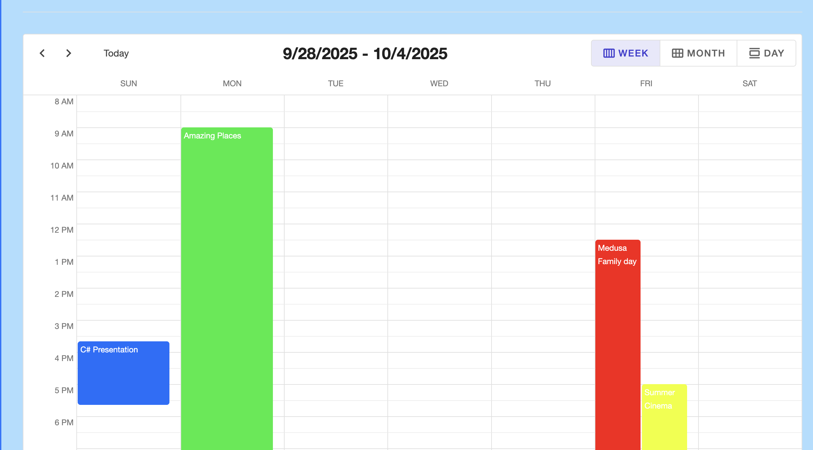
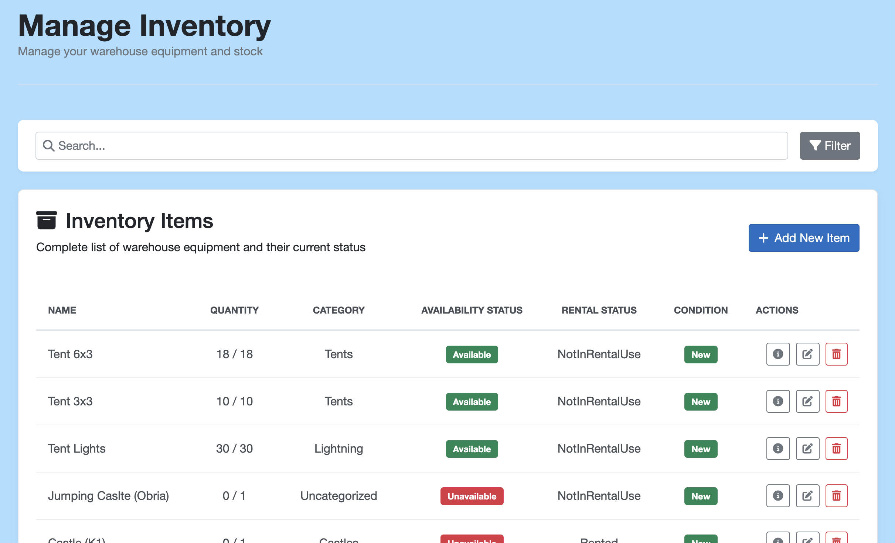

# Event Inventory Manager

This project is for managing inventory and equipment for event companies. This solution replaces the current Excel-based system, providing efficient tools for tracking inventory items, managing rentals, and planning events.

**Author:** Lukáš Hellesch

---
The goal is to create inventory management system that allows users to monitor their warehouse items and help with the planning of the events and loading the trucks for each event. The system also helps with managing rentals.

A visual representation of the inventory management interface:
## **Dashboard Overview:**
The dashboard provides overview with summary statistics. It displays active rentals/events and upcoming events, also there is an AI chatbot which can help with fast answering of questions



## **Events Management:**
The events interface shows a clean list view with event cards displaying location, date, time, client information, and contact details. Each event has an "Add Items" button for inventory assignment and inside that you can load the truck.






You can also view events in a calendar interface, which supports drag-and-drop functionality for easy rescheduling. Additionally, new events can be created directly within the calendar view.


## **Inventory Management:**
The inventory page displays a complete table of warehouse equipment including tents, lighting, and other items. Each item shows quantity, category, availability status, rental status, and condition with clear visual indicators.




---


## Main Features

- Inventory Tracking 
- Event Management 
- Rental System 
- Availability Status of items based on free stock
- Search & Filter in Inventory or with the help of AI
- Item Assignment to specific events
- Tracking condition of the items 
- AI chatbot
- Organize and optimize the loading order of items for truck loading

## Technologies

* ASP.NET Core with Blazor – Web application framework for the user interface
* SQLite – Lightweight, file-based database for data storage

## Repository Structure

```
/DOCS
    - user-guide.md
    - developer-guide.md
    - images/
/src
    - WarehouseManager.Core/    # Core business logic and entities
    - WarehouseManager.Infrastructure/        # Database 
    - WarehouseManager.Web/    # Web application|UI
    - Warehousemanager.Application/ #Use cases
```

## To get started follow these instructions

1. Clone the repository
   

2. Navigate to the source directory


3. You need to run following to update database in your pc locally
   ```
   dotnet ef database update --startup-project WarehouseManager.Web --project WarehouseManager.Infrastructure
   ```

4. Run the application with this command
   ```
   dotnet run --project WarehouseManager.Web
   ```

5. It should open automatically your web browser with the website (If not check the localhost: port on which it is running)

## Documentation

* [User Guide](DOCS/user-guide.md) – Instructions for using the inventory management system
* [Developer Guide](DOCS/developer-guide.md) – Technical details for contributors and developers


## Future 
* In future - My plan is to add features that you can plan and create events with the AI help he will store everything so you dont have to any many more new features with the AI. In all the event companies they are looking for some type of this AI solution that will help them with their operations.

* Possibility of importing a lot of data/items from a list 

* Importing / Syncing with google / apple calendar

